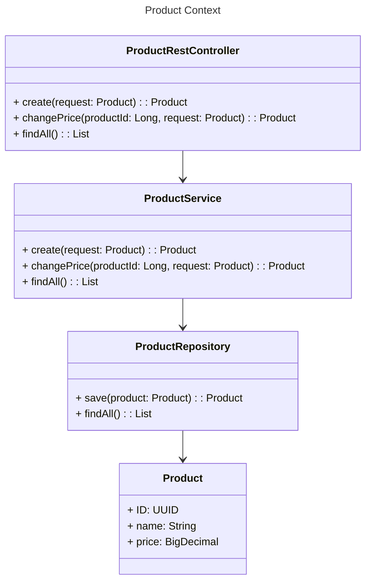
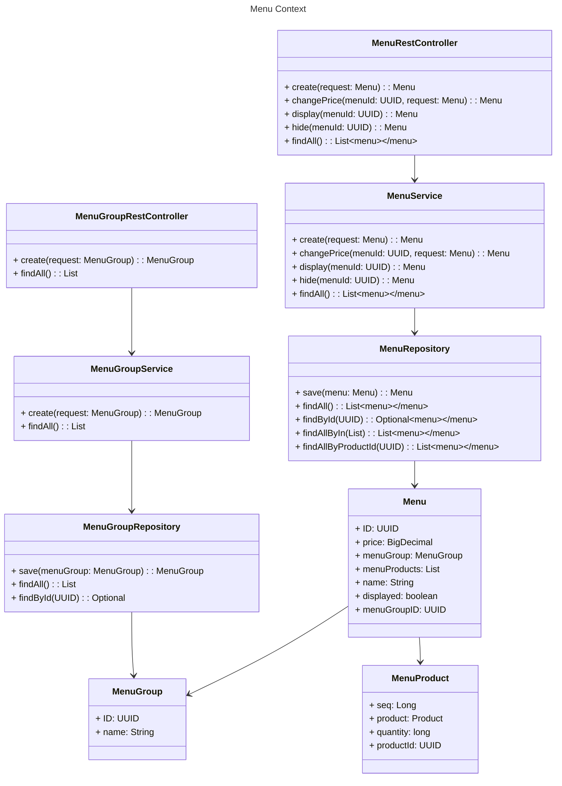
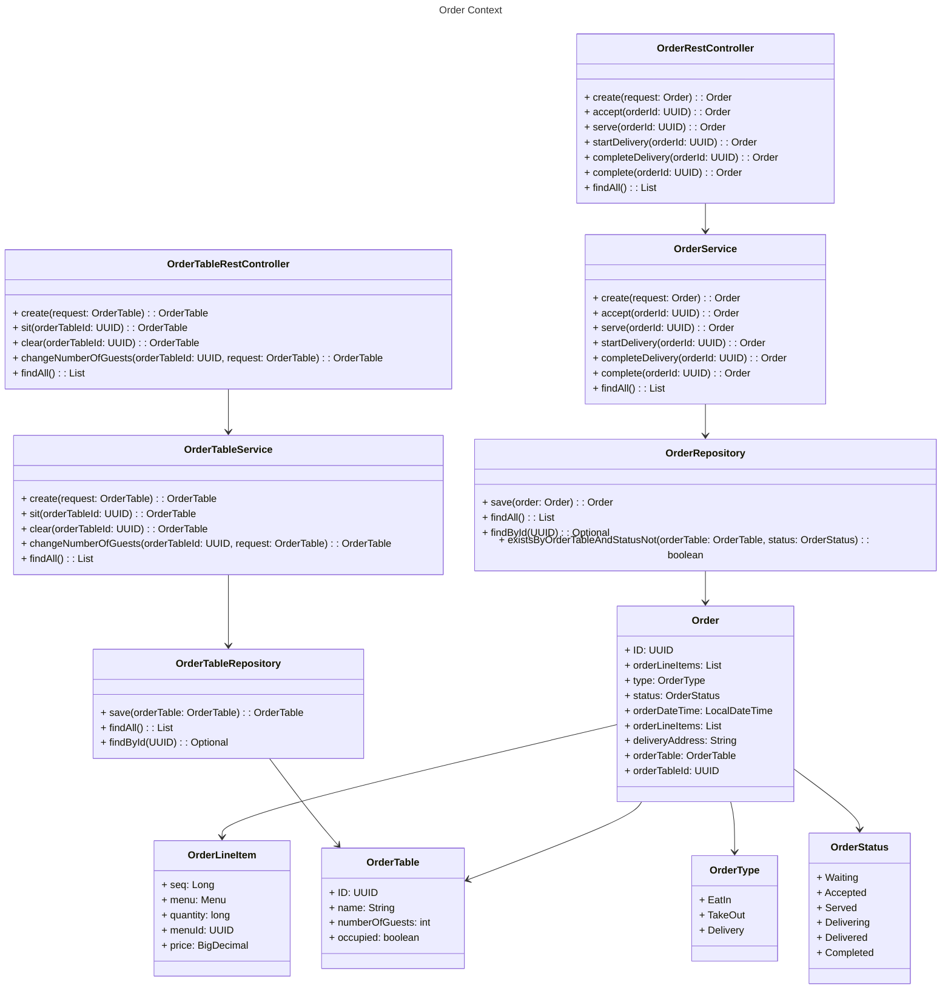
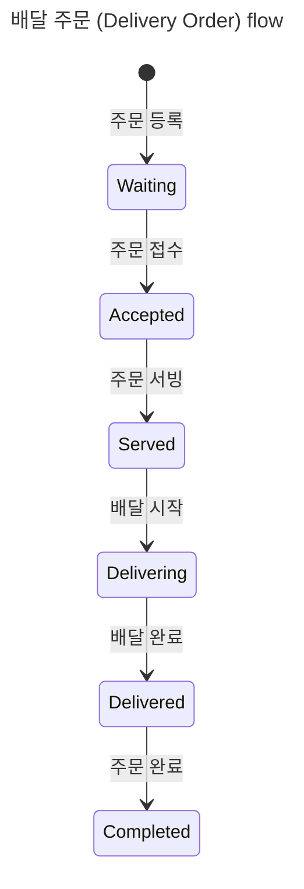
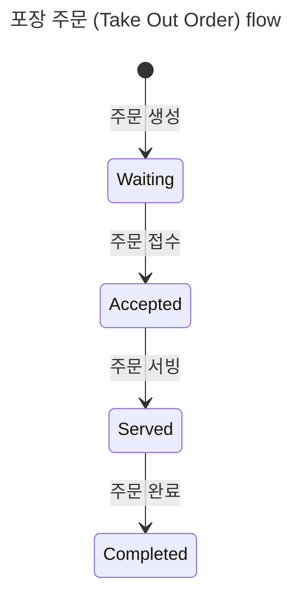
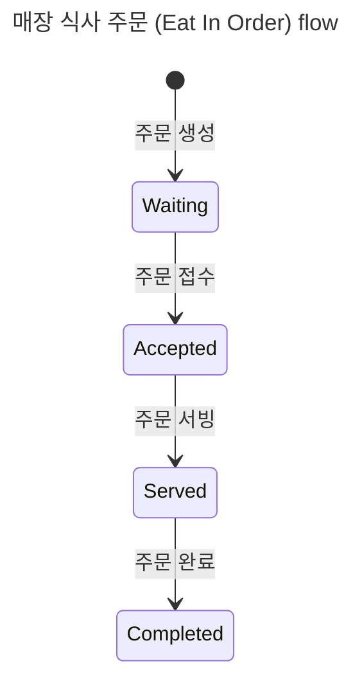

# 키친포스

## 퀵 스타트

```sh
cd docker
docker compose -p kitchenpos up -d
```

## 요구 사항

- 상품 (`Product`)
    - [ ] 상품 등록
        - 조건:
            - [ ] 상품의 가격은 0원 이상이어야 한다
            - [ ] 상품의 이름은 비어 있을 수 없다
            - [ ] 상품의 이름은 욕설, 비속어 등 부적절한 단어 포함 검사를 통과해야 한다 (외부 API 사용)
        - 결과:
            - [ ] 요청한 상품 이름으로 상품을 생성하여야 한다
            - [ ] 등록한 상품의 가격은 요청한 가격과 일치하여야 한다
    - [ ] 상품 가격 변경
        - 조건:
            - [ ] 변경할 가격은 0원 이상이어야 한다
            - [ ] 변경 대상인 상품이 존재하여야 한다
        - 결과:
            - [ ] 변경한 상품의 가격은 요청한 가격과 일치하여야 한다
            - 상품을 포함된 메뉴의 가격이 해당 메뉴에 포함된 메뉴 상품의 가격 합보다 비싸면
                - [ ] 메뉴의 상태를 비활성화 상태로 변경한다
    - [ ] 상품 목록을 조회
        - 결과:
            - [ ] 등록한 상품 목록을 조회하여야 한다
- 메뉴 그룹 (`MenuGroup`)
    - [ ] 메뉴 그룹 등록
        - 조건:
            - [ ] 메뉴 그룹의 이름은 비어 있을 수 없다
        - 결과:
            - [ ] 요청한 메뉴 그룹이름으로 메뉴 그룹을 등록하여야 한다
    - [ ] 메뉴 그룹 목록 조회
- 메뉴 상품 (`MenuProduct`)
    - [ ] 메뉴 상품 등록
        - 조건:
            - [ ] 메뉴 상품의 수량은 0개 이상이어야 한다
            - [ ] 메뉴 상품의 상품은 존재하여야 한다
        - 결과:
            - [ ] 메뉴 상품의 가격은 상품의 가격과 수량을 곱한 값과 일치하여야 한다
            - [ ] 메뉴 상품의 가격은 요청한 값과 일치하여야 한다
- 메뉴 (`Menu`)
    - [ ] 메뉴 등록
        - 조건:
            - [ ] 메뉴의 가격은 0원과 같거나 이상이어야 한다
            - [ ] 메뉴의 그룹은 존재하여야 한다
            - [ ] 메뉴 상품은 1개 이상 포함되어야 한다
            - [ ] 메뉴 상품은 상품을 포함하고 있어야 한다
            - [ ] 포함된 모든 메뉴 상품을 등록한다
            - [ ] 메뉴 가격이 전체 메뉴 상품의 가격 합보다 같거나 작아야 한다
            - [ ] 메뉴의 이름은 비어 있을 수 없다
            - [ ] 메뉴의 이름은 욕설, 비속어 등 부적절한 단어 포함 검사를 통과해야 한다 (외부 API 사용)
        - 결과:
            - [ ] 요청한 메뉴 이름으로 메뉴를 등록하여야 한다
            - [ ] 등록한 메뉴의 가격은 요청한 가격과 일치하여야 한다
            - [ ] 등록한 메뉴는 메뉴 그룹을 포함하고 있어야 한다
            - [ ] 등록한 메뉴의 상태는 요청한 상태와 일치하여야 한다
                - [ ] 등록한 메뉴는 요청한 메뉴 상품을 포함하고 있어야 한다
    - [ ] 메뉴 가격 변경
        - 조건:
            - [ ] 변경할 가격은 0원과 같거나 이상이어야 한다
            - [ ] 메뉴가 존재하여야 한다
            - [ ] 변경할 가격이 포함된 메뉴 상품의 가격 합보다 같거나 작아야 한다
        - 결과:
            - [ ] 변경한 메뉴의 가격은 요청한 가격과 일치하여야 한다
    - [ ] 메뉴 활성화
        - 조건:
            - [ ] 메뉴가 존재하여야 한다
            - [ ] 메뉴의 가격이 포함된 메뉴 상품의 가격 합보다 비싸면 안된다
        - 결과:
            - [ ] 메뉴의 상태는 활성화 상태로 변경되어야 한다
    - [ ] 메뉴 비활성화
        - 조건:
            - [ ] 메뉴가 존재하여야 한다
        - 결과:
            - [ ] 메뉴의 상태는 비활성화 상태로 변경되어야 한다
    - [ ] 메뉴 목록을 조회한다
        - 결과:
            - [ ] 등록한 메뉴 목록을 조회하여야 한다
- 주문 테이블 (`OrderTable`)
    - [ ] 주문 테이블 등록
        - 조건:
            - [ ] 주문 테이블의 이름은 비어 있을 수 없다
        - 결과:
            - [ ] 요청한 주문 테이블 이름으로 주문 테이블을 생성하여야 한다
            - [ ] 등록한 주문 테이블의 인원 수는 0명으로 설정되어야 한다
            - [ ] 등록한 주문 테이블 상태는 빈 테이블로 설정되어야 한다
    - [ ] 주문 테이블 사용
        - 조건:
            - [ ] 주문 테이블이 존재하여야 한다
        - 결과:
            - [ ] 주문 테이블 상태는 주문 중으로 변경되어야 한다
    - [ ] 주문 테이블 비우기
        - 조건:
            - [ ] 주문 테이블이 존재하여야 한다
            - [ ] 주문 테이블에 포함된 주문이 모두 완료 상태여야 한다
        - 결과:
            - [ ] 주문 테이블 상태는 빈 테이블로 변경되어야 한다
            - [ ] 주문 테이블의 인원 수가 0명으로 변경되어야 한다
    - [ ] 주문 테이블 인원 변경
        - 조건:
            - [ ] 변경할 인원 수는 0명과 같거나 이상이어야 한다
            - [ ] 주문 테이블이 존재하여야 한다
            - [ ] 주문 테이블 상태가 주문 중인 경우만 인원 수를 변경할 수 있다
        - 결과:
            - [ ] 주문 테이블의 인원 수는 변경된 인원 수로 설정되어야 한다
    - [ ] 주문 테이블 목록 조회
        - 결과:
            - [ ] 등록한 주문 테이블 목록을 조회하여야 한다
- 주문 항목 (`OrderLineItem`)
    - [ ] 주문 항목 등록
        - 조건:
            - [ ] 주문 항목의 메뉴는 존재하여야 한다
            - [ ] 주문 항목의 메뉴는 활성화된 상태여야 한다
            - [ ] 주문 항목의 가격은 포함된 메뉴의 가격과 일치하여야 한다
        - 결과:
            - [ ] 등록한 주문 항목의 수량은 요청한 수량과 일치하여야 한다
            - [ ] 등록한 주문 항목의 가격은 포함된 메뉴의 가격과 일치하여야 한다
- 주문 (`Order`)
    - 공통:
        - [ ] 주문 목록 조회
            - 결과:
                - [ ] 등록한 주문 목록을 조회하여야 한다
    - 배달(`DELIVERY`)인 경우:
        - [ ] 주문 등록
            - 조건:
                - [ ] 주문 타입은 배달이어야 한다
                - [ ] 주문에 주문 항목이 포함되어야 한다
                - [ ] 주문 항목의 개수와 포함된 메뉴 개수가 일치해야 한다
                - [ ] 주문 항목의 수량은 0개보다 커야 한다
                - [ ] 주문에 포함된 모든 주문 상세 항목을 등록한다
                - [ ] 주문에 포함된 주문 항목의 메뉴 수량이 0개보다 커야 한다
                - [ ] 배달 주소는 비어 있을 수 없다
            - 결과:
                - [ ] 등록된 주문의 타입은 배달이어야 한다
                - [ ] 등록한 주문의 상태는 대기로 설정되어야 한다
                - [ ] 등록한 주문의 주문 시간은 생성 시간으로 설정되어야 한다
                - [ ] 등록한 주문은 모든 주문 항목을 포함하고 있어야 한다
                - [ ] 등록한 주문은 배달 주소를 포함하고 있어야 한다
        - [ ] 주문 접수
            - 조건:
                - [ ] 주문이 존재하여야 한다
                - [ ] 주문의 상태가 대기인 경우만 접수 상태로 변경할 수 있다
                - [ ] 배달 업체에 배달을 요청한다 (외부 API 호출)
            - 결과:
                - [ ] 주문 상태는 접수로 변경되어야 한다
        - [ ] 주문 서빙
            - 조건:
                - [ ] 주문이 존재하여야 한다
                - [ ] 주문 상태가 접수인 경우만 조리 완료 상태로 변경할 수 있다
            - 결과:
                - [ ] 주문 상태는 조리 완료로 변경되어야 한다
        - [ ] 주문 배달 시작
            - 조건:
                - [ ] 주문이 존재하여야 한다
                - [ ] 주문 타입이 배달인 경우만 배달 중 상태로 변경할 수 있다
                - [ ] 주문 상태가 조리 완료인 경우만 배달 중 상태로 변경할 수 있다
            - 결과:
                - [ ] 주문 상태는 배달 중으로 변경되어야 한다
        - [ ] 주문 배달 완료
            - 조건:
                - [ ] 주문이 존재하여야 한다
                - [ ] 주문 상태가 배달 중인 경우만 배달 완료 상태로 변경할 수 있다
            - 결과:
                - [ ] 주문 상태는 배달 완료로 변경되어야 한다
        - [ ] 주문 완료
            - 조건:
                - [ ] 주문이 존재하여야 한다
                - [ ] 주문 타입이 배달이고 주문 상태가 배달 완료인 경우만 완료 상태로 변경할 수 있다
            - 결과:
                - [ ] 주문의 상태는 완료로 변경되어야 한다
    - 포장(`TAKE_OUT`)인 경우:
        - [ ] 주문 생성
            - 조건:
                - [ ] 주문 타입은 포장이어야 한다
                - [ ] 주문에 주문 항목이 포함되어야 한다
                - [ ] 주문 항목마다 메뉴 아이디로 메뉴를 포함하고 있어야 한다
                - [ ] 주문 항목의 개수와 포함된 메뉴 개수가 일치해야 한다
                - [ ] 주문에 포함된 모든 주문 항목을 등록한다
                - [ ] 주문에 포함된 주문 항목의 메뉴 수량이 0개보다 커야 한다
            - 결과:
                - [ ] 주문의 타입은 포장으로 설정되어야 한다
                - [ ] 주문의 상태는 대기로 설정되어야 한다
                - [ ] 주문의 주문 시간은 생성 시간으로 설정되어야 한다
                - [ ] 주문은 모든 주문 항목을 포함하고 있어야 한다
        - [ ] 주문 접수
            - 조건:
                - [ ] 주문이 존재하여야 한다
                - [ ] 주문의 상태가 대기인 경우만 접수 상태로 변경할 수 있다
            - 결과:
                - [ ] 주문의 상태는 접수로 변경되어야 한다
        - [ ] 주문 서빙
            - 조건:
                - [ ] 주문이 존재하여야 한다
                - [ ] 주문 상태가 접수인 경우만 조리 완료 상태로 변경할 수 있다
            - 결과:
                - [ ] 주문의 상태는 조리 완료로 변경되어야 한다
        - [ ] 주문 완료
            - 조건:
                - [ ] 주문이 존재하여야 한다
                - [ ] 주문 타입이 포장이고 주문 상태가 조리 완료인 경우만 완료 상태로 변경할 수 있다
            - 결과:
                - [ ] 주문의 상태는 완료로 변경되어야 한다
    - 매장 식사(`EAT_IN`)인 경우:
        - [ ] 주문 생성
            - 조건:
                - [ ] 주문 타입은 매장 식사이어야 한다
                - [ ] 주문에 주문 항목이 포함되어야 한다
                - [ ] 주문 항목마다 메뉴 아이디로 메뉴를 포함하고 있어야 한다
                - [ ] 주문 항목의 개수와 포함된 메뉴 개수가 일치해야 한다
                - [ ] 주문에 포함된 모든 주문 항목을 생성한다
                - [ ] 주문에 포함된 주문 항목의 메뉴 수량은 제한이 없다
                - [ ] 주문 테이블이 존재하여야 한다
                - [ ] 주문 테이블이 빈 상태여야 한다
            - 결과:
                - [ ] 주문의 타입은 매장 식사로 설정되어야 한다
                - [ ] 주문의 상태는 대기로 설정되어야 한다
                - [ ] 주문의 주문 시간은 생성 시간으로 설정되어야 한다
                - [ ] 주문은 모든 주문 항목을 포함하고 있어야 한다
                - [ ] 주문은 주문 테이블을 포함하고 있어야 한다
        - [ ] 주문 접수
            - 조건:
                - [ ] 주문이 존재하여야 한다
                - [ ] 주문의 상태가 대기인 경우만 접수 상태로 변경할 수 있다
            - 결과:
                - [ ] 주문의 상태는 접수로 변경되어야 한다
        - [ ] 주문 서빙
            - 조건:
                - [ ] 주문이 존재하여야 한다
                - [ ] 주문 상태가 접수인 경우만 조리 완료 상태로 변경할 수 있다
            - 결과:
                - [ ] 주문의 상태는 조리 완료로 변경되어야 한다
        - [ ] 주문 완료
            - 조건:
                - [ ] 주문이 존재하여야 한다
                - [ ] 주문 타입이 매장 식사이고 주문 상태가 조리 완료인 경우만 완료 상태로 변경할 수 있다
            - 결과:
                - [ ] 주문의 상태는 완료로 변경되어야 한다
                - 주문 테이블의 모든 주문이 완료 상태인 경우
                    - [ ] 주문 테이블을 비워야 한다
                    - [ ] 주문 테이블의 인원 수가 0명으로 변경되어야 한다

## 용어 사전

### 상품 컨텍스트 (Product Context)

| 한글명   | 영문명         | 설명                                |
|-------|-------------|-----------------------------------|
| 상품    | Product     | 매장에서 판매하는 단일 상품 (ex. 후라이드 치킨, 콜라) |
| 아이디   | ID          | 상품의 고유 식별자 (ex. 1, 2, 3)          |
| 이름    | Name        | 상품의 이름 (ex. 후라이드 치킨, 콜라)          |
| 가격    | Price       | 상품의 가격 (ex. 16,000원, 2,000원)      |
| 등록    | Create      | 상품을 등록한다                          |
| 가격 변경 | ChangePrice | 상품의 가격을 변경한다                      |
| 상품 목록 | FindAll     | 등록된 상품 목록을 조회한다                   |

### 메뉴 컨텍스트 (Menu Context)

#### 메뉴 그룹 (MenuGroup)

| 한글명      | 영문명       | 설명                             |
|----------|-----------|--------------------------------|
| 메뉴 그룹    | MenuGroup | 메뉴에 대한 분류 혹은 카테고리 (ex. 치킨, 음료) |
| 아이디      | ID        | 메뉴 그룹의 고유 식별자 (ex. 1, 2, 3)    |
| 이름       | Name      | 메뉴 그룹의 이름 (ex. 치킨, 음료)         |
| 등록       | Create    | 메뉴 그룹을 등록한다                    |
| 메뉴 그룹 목록 | FindAll   | 등록된 메뉴 그룹 목록을 조회한다             |

#### 메뉴 (Menu)

| 한글명   | 영문명            | 설명                                                   |
|-------|----------------|------------------------------------------------------|
| 메뉴 상품 | MenuProduct    | 메뉴에 포함된 상품과 수량 (ex. 후라이드 치킨 1마리, 콜라 1개)              |
| 메뉴    | Menu           | 매장에서 판매하는 조합 상품 (ex. 후라이드 치킨 세트[후라이드 치킨 1마리, 콜라 1개]) |
| 메뉴 상태 | Menu Displayed | 메뉴의 상태는 시각적으로 보여지는 상태 (ex. 표시, 숨김)                   |
| 아이디   | ID             | 메뉴, 메뉴 그룹, 메뉴 상품의 고유 식별자 (ex. 1, 2, 3)               |
| 이름    | Name           | 이름                                                   |
| 수량    | Quantity       | 수량                                                   |
| 가격    | Price          | 가격                                                   |
| 등록    | Create         | 메뉴를 등록한다                                             |
| 가격 변경 | ChangePrice    | 메뉴의 가격을 변경한다                                         |

#### 메뉴 상태 (Menu Displayed)

| 한글명 | 영문명       | 설명                   |
|-----|-----------|----------------------|
| 표시  | Displayed | 메뉴가 시각적으로 보여지는 상태    |
| 숨김  | Hidden    | 메뉴가 시각적으로 보여지지 않는 상태 |

### 주문 컨텍스트 (Order Context)

#### 주문 항목 (OrderLineItem)

| 한글명   | 영문명           | 설명                                    |
|-------|---------------|---------------------------------------|
| 주문 항목 | OrderLineItem | 주문에 포함된 메뉴 (ex. 후라이드 치킨 세트 1개, 콜라 1개) |
| 아이디   | ID            | 주문 항목의 고유 식별자 (ex. 1, 2, 3)           |
| 메뉴    | Menu          | 주문 항목에 포함된 메뉴 (ex. 후라이드 치킨 세트)        |
| 수량    | Quantity      | 수량                                    |
| 가격    | Price         | 가격                                    |

#### 주문 테이블 (OrderTable)

| 한글명          | 영문명                  | 설명                                   |
|--------------|----------------------|--------------------------------------|
| 주문 테이블       | OrderTable           | 매장에서 주문을 받는 테이블 (ex. 1번 테이블, 2번 테이블) |
| 주문 테이블 인원    | NumberOfGuests       | 주문 테이블에 앉은 인원 수 (ex. 4명)             |
| 주문 테이블 상태    | OrderTable Occupied  | 주문 테이블의 상태 (ex. 빈 테이블, 주문 중)         |
| 아이디          | ID                   | 주문 테이블의 고유 식별자 (ex. 1, 2, 3)         |
| 이름           | Name                 | 주문 테이블의 이름 (ex. 1번 테이블, 2번 테이블)      |
| 상태           | Occupied             | 주문 테이블의 상태 (ex. 빈 테이블, 주문 중)         |
| 인원 수         | NumberOfGuests       | 주문 테이블에 앉은 인원 수 (ex. 4명)             |
| 주문 테이블 사용    | Sit                  | 주문 테이블을 사용한다                         |
| 주문 테이블 비우기   | Clear                | 주문 테이블을 비운다                          |
| 주문 테이블 인원 변경 | ChangeNumberOfGuests | 주문 테이블의 인원 수를 변경한다                   |
| 주문 테이블 목록 조회 | FindAll              | 주문 테이블 목록을 조회한다                      |

#### 주문 상태 (OrderStatus)

| 한글명   | 영문명        | 설명                        |
|-------|------------|---------------------------|
| 대기    | Waiting    | 주문이 등록되어 대기 중인 상태         |
| 접수    | Accepted   | 주문이 접수된 상태                |
| 조리 완료 | Served     | 주문이 조리 완료된 상태             |
| 배달 중  | Delivering | 주문이 배달 중인 상태 (배달 주문인 경우)  |
| 배달 완료 | Delivered  | 주문이 배달 완료된 상태 (배달 주문인 경우) |
| 완료    | Completed  | 주문이 완료된 상태                |

#### 주문 타입 (OrderType)

| 한글명   | 영문명      | 설명          |
|-------|----------|-------------|
| 매장 식사 | Eat In   | 매장에서 주문한 경우 |
| 포장    | Take Out | 포장 주문       |
| 배달    | Delivery | 배달 주문       |

#### 배달 주문 (Delivery Order)

| 한글명   | 영문명                 | 설명                                                 |
|-------|---------------------|----------------------------------------------------|
| 주문 항목 | OrderLineItem       | 주문에 포함된 메뉴 (ex. 후라이드 치킨 세트 1개, 콜라 1개)              |
| 주문    | Order               | 매장에서 주문한 내역 (ex. 1번 테이블에서 후라이드 치킨 세트 1개, 콜라 1개 주문) |
| 주문 시간 | OrderDateTime       | 주문이 발생한 시간 (ex. 2021-07-01 12:00:00)               |
| 등록    | Create              | 주문을 등록한다                                           |
| 접수    | Accept              | 주문을 접수한다                                           |
| 서빙    | Serve               | 주문을 서빙한다                                           |
| 배달 시작 | Start Delivery      | 주문 배달을 시작한다 (배달 주문인 경우)                            |
| 배달 완료 | Complete Delivery   | 주문 배달을 완료한다 (배달 주문인 경우)                            |
| 완료    | Complete            | 주문을 완료한다                                           |
| 배달 주소 | DeliveryAddress     | 배달 주소 (ex. 서울시 강남구 역삼동 123-456)                    |
| 아이디   | ID                  | 주문, 주문 항목, 주문 테이블 등의 고유 식별자 (ex. 1, 2, 3)          |
| 수량    | Quantity            | 수량                                                 |
| 가격    | Price               | 가격                                                 |
| 배달 업체 | KitchenridersClient | 배달을 담당하는 업체                                        |

#### 포장 주문 (Take Out Order)

| 한글명   | 영문명           | 설명                                                 |
|-------|---------------|----------------------------------------------------|
| 주문 항목 | OrderLineItem | 주문에 포함된 메뉴 (ex. 후라이드 치킨 세트 1개, 콜라 1개)              |
| 주문    | Order         | 매장에서 주문한 내역 (ex. 1번 테이블에서 후라이드 치킨 세트 1개, 콜라 1개 주문) |
| 주문 시간 | OrderDateTime | 주문이 발생한 시간 (ex. 2021-07-01 12:00:00)               |
| 등록    | Create        | 주문을 등록한다                                           |
| 접수    | Accept        | 주문을 접수한다                                           |
| 서빙    | Serve         | 주문을 서빙한다                                           |
| 완료    | Complete      | 주문을 완료한다                                           |
| 아이디   | ID            | 주문, 주문 항목, 주문 테이블 등의 고유 식별자 (ex. 1, 2, 3)          |
| 수량    | Quantity      | 수량                                                 |
| 가격    | Price         | 가격                                                 |

#### 매장 식사 주문 (Eat In Order)

| 한글명   | 영문명           | 설명                                                 |
|-------|---------------|----------------------------------------------------|
| 주문 항목 | OrderLineItem | 주문에 포함된 메뉴 (ex. 후라이드 치킨 세트 1개, 콜라 1개)              |
| 주문    | Order         | 매장에서 주문한 내역 (ex. 1번 테이블에서 후라이드 치킨 세트 1개, 콜라 1개 주문) |
| 주문 시간 | OrderDateTime | 주문이 발생한 시간 (ex. 2021-07-01 12:00:00)               |
| 등록    | Create        | 주문을 등록한다                                           |
| 접수    | Accept        | 주문을 접수한다                                           |
| 서빙    | Serve         | 주문을 서빙한다                                           |
| 완료    | Complete      | 주문을 완료한다                                           |
| 아이디   | ID            | 주문, 주문 항목, 주문 테이블 등의 고유 식별자 (ex. 1, 2, 3)          |
| 수량    | Quantity      | 수량                                                 |
| 가격    | Price         | 가격                                                 |

## 모델링

### 상품 컨텍스트 (Product Context)



- `Product`을 등록할 수 있다.
    - 제약 조건
        - `Product`의 `price`은 0원 이상이어야 한다.
        - `Product`의 `name`은 비어 있을 수 없다.
        - `Product`의 `name`은 욕설, 비속어 등 부적절한 단어가 포함할 수 없다. (외부 API 사용)
- `Product`의 `price`을 변경할 수 있다.
    - 제약 조건
        - 변경할 `price`은 0원 이상이어야 한다.
- `Product` 목록을 조회할 수 있다.

### 메뉴 컨텍스트 (Menu Context)



#### 메뉴 그룹 (MenuGroup)

- `MenuGroup`을 등록할 수 있다.
    - 제약 조건
        - `MenuGroup`의 `name`은 비어 있을 수 없다.
- 등록된 `MenuGroup` 목록을 조회할 수 있다.

#### 메뉴 상품 (MenuProduct)

- `MenuProduct`을 등록할 수 있다.
    - 제약 조건
        - `MenuProduct`의 `quantity`은 0개 이상이어야 한다.
        - `MenuProduct`의 `Product`은 존재하여야 한다.
        - `MenuProduct`의 `name`과 `price`를 포함하고 있어야 한다.

#### 메뉴 (Menu)

- `Menu`을 등록할 수 있다.
    - 제약 조건
        - `Menu`의 `price`은 0원과 같거나 이상이어야 한다.
        - `Menu`의 `MenuGroup`이 포함되어야 한다.
        - `Menu`의 `MenuProduct`은 1개 이상 포함되어야 한다.
        - `Menu`의 `price`가 전체 `MenuProduct`의 `price` 합보다 같거나 작아야 한다.
        - `Menu`의 `name`은 비어 있을 수 없다.
        - `Menu`의 `name`은 욕설, 비속어 등 부적절한 단어 포함 검사를 통과해야 한다.
- `Menu`의 `price`을 변경할 수 있다.
    - 제약 조건
        - 변경할 `price`은 0원과 같거나 이상이어야 한다.
        - 변경할 `price`이 포함된 `MenuProduct`의 `price` 합보다 같거나 작아야 한다.
- `Menu`을 표시 상태로 변경할 수 있다.
    - 제약 조건
        - `Menu`의 `price`가 포함된 `MenuProduct`의 `price` 합보다 비싸면 안된다.
- `Menu`을 숨김 상태로 변경할 수 있다.
- 등록된 `Menu` 목록을 조회할 수 있다.

### 주문 컨텍스트 (Order Context)



#### 주문 테이블 (OrderTable)

- `OrderTable`을 등록할수 있다. 동시에 고객 수를 0명으로 테이블 상태는 빈 테이블로 설정된다.
    - 제약 조건
        - `OrderTable`의 `name`은 비어 있을 수 없다
- `OrderTable` 상태를 주문 중으로 변경할 수 있다.
- `OrderTable` 상태가 빈 테이블 상태로 변경할 수 있다. 동시에 고객 수를 0명으로 설정한다.
    - 제약 조건
        - `OrderTable`에 포함된 주문이 모두 완료 상태여야 한다.
- `OrderTable`의 고객 수를 변경할 수 있다.
    - 제약 조건
        - 변경할 고객 수는 0명과 같거나 이상이어야 한다.
        - `OrderTable` 상태가 주문 중인 경우만 고객 수를 변경할 수 있다.
- 등록된 `OrderTable` 목록을 조회할 수 있다.

#### 주문 항목 (OrderLineItem)

- `OrderLineItem`을 등록할 수 있다.
    - 제약 조건
        - `OrderLineItem`의 `Menu`는 존재하여야 한다.
        - `OrderLineItem`의 `Menu`는 표시 상태여야 한다.
        - `OrderLineItem`의 `price`은 포함된 `Menu`의 `price`와 일치하여야 한다.

#### 주문 (Order)

- 등록된 `Order` 목록을 조회할 수 있다.

##### 배달 주문 (Delivery Order)



- 필수 요구사항
    - `Order` 타입은 배달(`Delivery`)이어야 한다.
- `Order`를 등록할 수 있다. 등록된 `Order`상태는 `Waiting`으로  `Order` 주문 시간은 생성 시간으로 설정된다.
    - 제약 조건
        - `Order`에 `주문항목`이 포함되어야 한다.
        - `주문항목`의 개수와 포함된 `Menu` 개수가 일치해야 한다.
        - `주문항목`의 `quantity`은 0개보다 커야 한다.
        - `Order`에 포함된 `주문항목`의 `Menu` 수량이 0개보다 커야 한다. (> 0)
        - `DeliveryAddress`는 비어 있을 수 없다.
- `Order`를 접수할 수 있다. `Order`의 상태는 `Accepted`로 변경된다.
    - 제약 조건
        - `Order` 상태가 `Waiting`이여야 한다.
        - `KitchenridersClient`에 배달을 요청한다. (외부 API 호출)
- `Order`를 서빙할 수 있다. `Order`의 상태는 `Served`로 변경된다.
    - 제약 조건
        - `Order` 상태가 `Accepted`이여야 한다.
- `Order`를 배달 시작할 수 있다. `Order`의 상태는 `Delivering`로 변경된다.
    - 제약 조건
        - `Order` 상태가 `Served`인 경우만 `Delivering`로 변경할 수 있다.
- `Order`를 배달 완료할 수 있다. `Order`의 상태는 `Delivered`로 변경된다.
    - 제약 조건
        - 주문 상태가 `Delivering`인 경우만 `Delivered`로 변경할 수 있다.
- `Order`를 완료할 수 있다. `Order`의 상태는 `Completed`로 변경된다.
    - 제약 조건
        - 주문 상태가 `Delivered`인 경우만 `Completed`로 변경할 수 있다.

##### 포장 주문 (Take Out Order)



- 필수 요구사항
    - `Order` 타입은 포장(`Take Out`)이어야 한다.
- `Order`를 등록할 수 있다. `Order` 상태는 `Waiting`으로 설정되고 `Order` 주문 시간은 생성 시간으로 설정된다.
    - 제약 조건
        - `Order`에 `주문항목`이 포함되어야 한다.
        - `주문항목`의 `Menu` 수량은 0개보다 커야 한다.
        - `주문항목`의 개수와 포함된 `Menu` 개수가 일치해야 한다.
- `Order`를 접수할 수 있다. `Order`의 상태는 `Accepted`로 변경된다.
    - 제약 조건
        - `Order` 상태가 `Waiting`이여야 한다.
- `Order`를 서빙할 수 있다. `Order`의 상태는 `Served`로 변경된다.
    - 제약 조건
        - `Order` 상태가 `Accepted`이여야 한다.
- `Order`를 완료할 수 있다. `Order`의 상태는 `Completed`로 변경된다.
    - 제약 조건
        - `Order` 상태가 `Served`인 경우만 `Completed`로 변경할 수 있다.

##### 매장 식사 주문 (Eat In Order)



- 필수 요구사항
    - `Order` 타입은 매장 식사(`Eat In`)이어야 한다.
- `Order`를 등록할 수 있다. `Order` 상태는 `Waiting`으로 설정되고 `Order` 주문 시간은 생성 시간으로 설정된다.
    - 제약 조건
        - `Order`에 `주문항목`이 포함되어야 한다.
        - `주문항목`의 `Menu` 수량은 제한이 없다.
        - `주문항목`의 개수와 포함된 `Menu` 개수가 일치해야 한다.
        - `Order`에 포함된 `OrderTable`이 존재하여야 한다.
        - `OrderTable` 상태가 빈 테이블이여야 한다.
- `Order`를 접수할 수 있다. `Order`의 상태는 `Accepted`로 변경된다.
    - 제약 조건
        - `Order` 상태가 `Waiting`이여야 한다.
- `Order`를 서빙할 수 있다. `Order`의 상태는 `Served`로 변경된다.
    - 제약 조건
        - `Order` 상태가 `Accepted`이여야 한다.
- `Order`를 완료할 수 있다. `Order`의 상태는 `Completed`로 변경된다. 한다. `OrderTable`의 모든 주문을 체크하여 모두 완료 상태인 경우 `OrderTable`을 비운다.
    - 제약 조건
        - `Order` 상태가 `Served`인 경우만 `Completed`로 변경할 수 있다.
